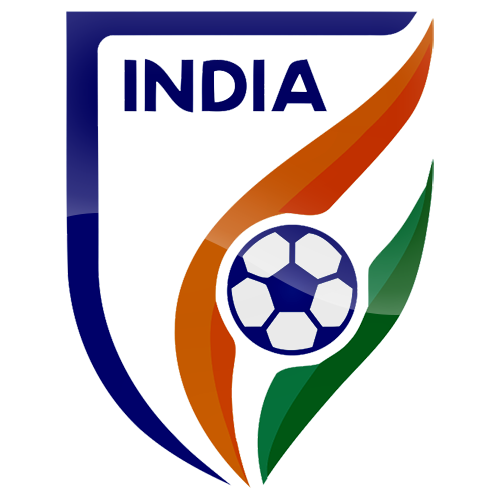
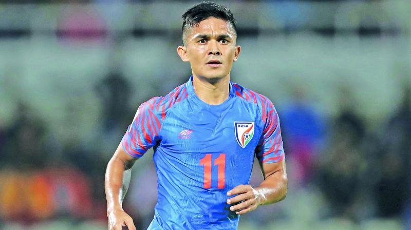

<!DOCTYPE html>
<html>
<head>
  <link rel="stylesheet" href="style.css">
  <title>Football</title>
  </head>
<body>
  <h1>Lets Football</h1>
  

    
  Indian Team
  

  

    
    
The All India Football Federation, simply known as the AIFF, is the governing body of association football in India. Formed in 1937,
the federation was one of founding members of the Asian Football Confederation, the overseer of football in Asia.
The AIFF sanctions and runs all competitive football tournaments and leagues at a national level, namely the Indian Super League, I-League and Super Cup.
The federation also indirectly manages local football competitions through the state associations. The federation is also responsible for managing the India national football team,
as well as the women's team and the various youth national sides.
The AIFF is also part of the South Asian Football Federation, the organization that runs football in South Asia. The federation is currently based in Dwarka, Delhi.

  </body>
</html>
